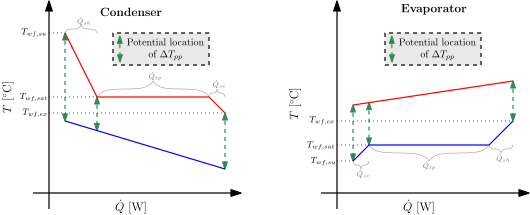

Heat Exchanger - Constant Pinch Model
==========================================

Model description
-----------------

Usage of a pinch point to model a Heat Exchanger (HEX) is typically done when modelling a phase-changing HEX. This approach is usually applied for evaporators and condensers. The pinch point corresponds to the location 
of the HEX where the temperature difference between the two fluids implied in the HEX is minimal. One of the two fluids is expected to be phase-changing. After phase-changing, the subcooling or superheating of the fluid 
is to be considered. 
The following assumptions are made:

- Steady-state operation
- No pressure drops
- No heat losses to the ambient
- Counterflow configuration

The model performs a discretisation of the HEX in one to three zones corresponding to the potential phases encountered by the phase-changing fluid in the HEX length, namely:

- Superheated vapor zone
- Two-phase zone
- Subcooled liquid zone

The pinch point temperature difference (:math:`\Delta T_{pp}`) is the minimum temperature difference that can be seen between the two fluids in the HEX. It is located relatively to the phase-changing fluid as 
being either at the HEX inlet, two-phase zone inlet or at the HEX outlet. The schematic representation of these possible locations can be found in the figure below. 
The other fluid is considered as remaning in the same phase in the HEX.

The model takes as input the fluids conditions at the supply of both sides of the HEX, namely the fluid type, its pressure and its specific enthalpy (mass-based). The fluids are identified as hot ("H") 
and cold ("C"). The model parameters are:

- The pinch point temperature difference: "Pinch"
- The superheating (if evaporator) or subcooling (if condenser): "Delta_T_sh_sc"
- The HEX type, i.e. evaporator or condenser: "HX_type"

The outputs of the model are the fluids conditions at the exhaust of the HEX (pressure and specific enthalpy for both hot and cold sides) and the HEX heat duty.

Class description
-----------------
.. autoclass:: component.heat_exchanger.hex_cstpinch.HexCstPinch

Example of use
-----------------
.. literalinclude:: ../../../../../../labothappy/component/examples/heat_exchanger/hex_cstpinch_example.py
   :language: python
   
References
----------
/